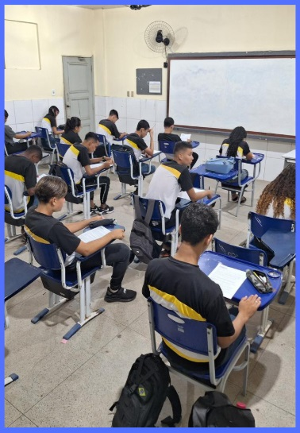

```{=html}
<style>
body{text-align: justify}
</style>
```

:::: progress
::: {.progress-bar style="width: 100%;"}
:::
::::

# O Que é a Metodologia da Transitividade

A Metodologia da Transitividade é uma proposta pedagógica, de forte inspiração **Freiriana**, que visa conduzir o estudante da percepção imediata e ingênua de sua realidade para uma compreensão estrutural e crítica. A palavra "transitividade" refere-se exatamente a este movimento de transição cognitiva e social, no qual o indivíduo deixa de ser um mero espectador das contradições a seu redor e passa a investigá-las ativamente.

{fig-align="center" width="177"}

Seus objetivos educacionais centrais incluem romper com a educação “bancária” (aquela que apenas deposita conteúdos no aluno), integrar o currículo escolar à vida real dos educandos e formar sujeitos capazes de analisar e intervir em sua realidade.

:::: progress
::: {.progress-bar style="width: 100%;"}
:::
::::

## PrincÍpios Centrais

-   **Diálogo**: Relação horizontal entre educador e educando, onde ambos aprendem e investigam juntos.
-   **Leitura Crítica da Realidade**: Partir do contexto vivido pelo aluno para desvelar as estruturas sociais.
-   **Articulação Teoria-Prática**: O conhecimento escolar é mobilizado para explicar e transformar problemas reais.
-   **Passagem da Ingenuidade à Criticidade**: Superação de opiniões baseadas no senso comum por meio da investigação metódica.
-   **Protagonismo Estudantil**: O estudante como autor de seu processo de aprendizagem e de leitura social.

::: {.callout-tip collapse="false"}
"**EM SÍNTESE** : A Metodologia da Transitividade é um caminho educacional que usa a investigação do cotidiano para ajudar o aluno a enxergar as raÍzes dos problemas sociais, transformando a observação passiva em questionamento crÍtico com autonomia.".
:::

:::: progress
::: {.progress-bar style="width: 100%;"}
:::
::::
