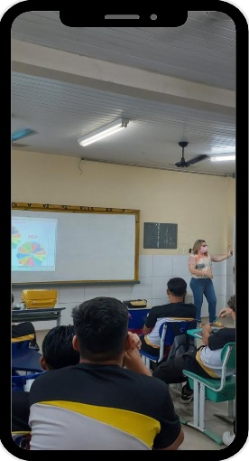
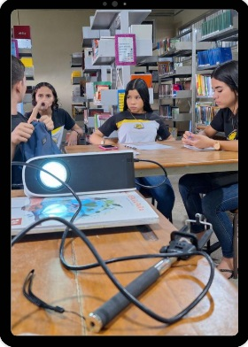
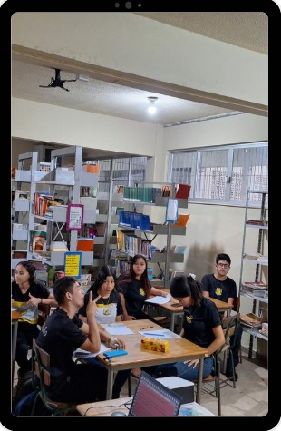
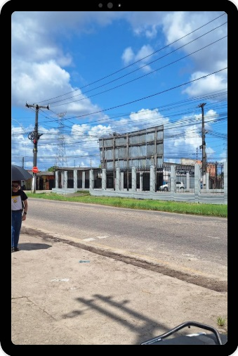
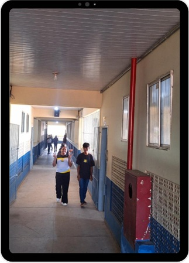

```{=html}
<style>
  body{text-align: justify}
</style>
```

:::: progress
::: {.progress-bar style="width: 100%;"}
:::
::::

# Detlhamento das Etapas

## Organização Inicial

**Objetivo**: O professor apresenta a proposta, explica que a atividade
não é apenas “gravar um vídeo”, mas investigar a realidade e
transformá-la em leitura crítica. Também organiza grupos, define prazos,
conversa sobre uso responsável de imagem, ética digital e finalidade
pedagógica da produção.

**O Que os Estudantes Fazem**: Compreendem a intencionalidade do
trabalho formam suas equipes de investigação e começam a debater
possíveis temas.

{fig-align="center" width="135"}

:::: progress
::: {.progress-bar style="width: 100%;"}
:::
::::

## Diálogos com os Alunos

Nesse momento inicial, o professor promove uma roda de conversa para
ouvir os estudantes sobre questões que merecem ser discutidas. Inicia
com perguntas, em vez de começar pelo conteúdo pronto, começa pela
experiência vivida pelos alunos.

Esse movimento aparece no documento como um momento de aproximação e
escuta, em coerência com o processo educativo dialógico.

{fig-align="center" width="183"}

### Exemplos de Perguntas Problematizadoras:

-   O que mais incomoda vocês na escola ou no bairro?
-   Que situações todo mundo vê, mas quase ninguém discute?
-   Se vocês pudessem denunciar, explicar ou conscientizar sobre algo em
    1 minuto, o que seria?
-   Que tipo de vídeo vocês consomem nas redes que prende atenção?

### Exemplo de Atividade em Sala

Cada aluno escreve em um post-it ou formulário:

1.  um problema que observa;
2.  uma pergunta que gostaria de investigar;
3.  uma ideia de vídeo curto sobre esse problema.

### Produto Esperado

-   Mapa de interesses da turma.

:::: progress
::: {.progress-bar style="width: 100%;"}
:::
::::

## Diálogos com a Realidade

Dialogar com os alunos sobre o olhar a realidade de forma mais atenta,
saindo de opiniões genéricas e indo para observações concreta.

{fig-align="center" width="171"}

O professor conduz uma atividade de leitura do espaço escolar ou do
entorno. O importante aqui é deslocar o olhar:

-   “o que vemos?”,
-   “quem aparece?”,
-   “quem não aparece?”,
-   “que contradições existem?”.

No documento, esse momento prepara os estudantes para observar
criticamente seu contexto antes do registro audiovisual.

### Exemplos de Perguntas Problematizadoras:

-   O que mais incomoda vocês na escola ou no bairro?
-   Que situações todo mundo vê, mas quase ninguém discute?
-   Se vocês pudessem denunciar, explicar ou conscientizar sobre algo em
    1 minuto, o que seria?
-   Que tipo de vídeo vocês consomem nas redes que prende atenção?

### Exemplo de Atividade Prática:

Se o tema for lixo no entorno da escola, os alunos podem observar:

-   onde há mais lixo acumulado;
-   em que horários isso acontece;
-   se há lixeiras suficientes;
-   quem é responsabilizado pelo problema;
-   como os moradores ou estudantes percebem isso.

### Sugestão de Recurso

-   Use uma ficha simples de observação com três colunas:
    -   o que vimos?
    -   por que isso acontece?
    -   que pergunta isso gera?

### Produto Esperado

-   Registro de observações e primeiras hipóteses.

:::: progress
::: {.progress-bar style="width: 100%;"}
:::
::::

## Investigação da Área de Estudo

É o momento de construir o levantamento preliminar do tema escolhido de
modo mais sistemático.

O professor dialoga com os alunos sobre a coleta inicial de relatos,
cenas, imagens e falas significativas. É a 1ª etapa da investigação
temática, quando ocorre o levantamento preliminar da realidade estudada.

Os estudantes definem o que querem descobrir, quem pretendem entrevistar
e em quais espaços farão as filmagens.

{fig-align="center" width="174"}

### Exemplo de Temática que pode surgir:

“As dificuldades de mobilidade que os alunos enfrentam para chegar à
escola”.

### Miniatividade Investigativa

-   Qual é o problema?
-   Onde ele aparece?
-   Quem é afetado?
-   Como ele costuma ser explicado?
-   O que ainda precisamos descobrir?

### Produto Esperado

-   Um dossiê inicial do tema com anotações, fotos, falas e perguntas

:::: progress
::: {.progress-bar style="width: 100%;"}
:::
::::

## Codificação das Experiências Sociais

É o momento de transformar situações reais em materiais de registro:
fotos, áudios, vídeos, entrevistas, cenas do cotidiano.

De acordo com a concepção freiriana, a codificação consiste em registrar
aspectos da realidade para que depois eles possam ser analisados. Essa é
a fase da captação de “retratos” da realidade.

{fig-align="center" width="171"}

O professor com os alunos detalham as noções simples tais como:

-   Técnicas de Enquadramento;
-   Plano Aberto, Médio e Close;
-   Captação de áudio;
-   Iluminação;
-   Gravação na vertical ou na horizontal para Reels/TikTok/Shorts;
-   Autorização de imagem quando houver entrevistas gravadas.

### Atividades que as Equipes podem Realizar

-   Coletar as opiniões de colegas;
-   Registrar a chegada dos alunos;
-   Enquete sobre os riscos identificados no trajeto;
-   Fazer fotos e vídeos das vias do bairro, das ciclovias, faixas de
    travessia de pedestres, pontos de ônibus, etc;
-   Filmar o trânsito no entorno da escola.

### Exemplos de Gravações que podem Realizar

-   Gravação de alunos nos pontos de ônibus;
-   Gravação de alunos que vem de bicicletas pelas ciclofaixas;
-   Entrevistas curtas com estudantes;
-   Cenas de deslocamento de alunos pedestres;
-   Fla em off com dados ou reflexões.

### Modelo a ser utilizado (vídeo denúncia em 45 seg)

1.  Abertura com pergunta forte;
2.  Cenas do problema;
3.  Fala de 2 colegas;
4.  Dado simples;
5.  Conclusão com proposta.

### Produto Esperado:

-   Banco de imagens e vídeos do grupo.

:::: progress
::: {.progress-bar style="width: 100%;"}
:::
::::

## Diálogos Descodificadores

É o momento no qual educandos e educadores vão interpretar criticamente
o material.

Esta é uma etapa decisiva. O professor exibe os registros e conduz a
análise coletiva: o que o vídeo mostra? O que ele esconde? Que
contradições aparecem? Que causas estruturais podem estar por trás? No
documento, esta etapa é chamada de diálogos descodificadores e serve
para sair da aparência e chegar à problematização crítica.

### Perguntas de Descodificação

-   O que aparece com mais força nas imagens?
-   Que problema social está sendo revelado?
-   Isso é um caso isolado ou algo recorrente?
-   Quem ganha e quem perde com essa situação?
-   Como a escola, a comunidade ou o poder público entram nisso?
-   O vídeo reforça apenas questões comportamentais ou ajuda a pensar
    como um problema coletivo?

### Exemplo que podem ser Problematizados

No caso a codificação tenha sido os alunos no trânsito, pois a partir
desse exemplo podem surgir outras temáticas:

-   Os problemas enfrentados no trânsito são apenas de imprudência dos
    condutores?
-   Quais riscos os alunos identificam no trajeto até a escola?
-   As vias do bairro são seguras e bem sinalizadas?
-   Quem é responsável pelo trânsito no município?

### Produto Esperado

-   Uma síntese crítica do tema em 5 a 8 frases

::: {.callout-tip collapse="false"}
"**OUTRO EXEMPLO PRÁTICO:** Caso o tema fosse a Merenda Escolar. Após
ver os registros codificados, a turma poderia discutir:

-   O Problema é quantidade, qualidade ou organização da escola?
-   Os Estudantes só reclamam ou conseguem explicar melhor a questão?
-   O Vídeo está culpando pessoas específicas ou analisando uma situação
    maior?
-   Como Apresentar o problema com responsabilidade?
:::

:::: progress
::: {.progress-bar style="width: 100%;"}
:::
::::

## Redução Temática

A finalidade é recortar o foco central do vídeo para que ele fique
claro, coerente e pedagógico.

Depois da discussão, o professor ajuda os alunos a definir qual aspecto
do problema será abordado. Nessa etapa de redução temática é o momento
em que o tema investigado é delimitado para ganhar forma educativa.

### Perguntas de Descodificação

-   O que aparece com mais força nas imagens?
-   Que problema social está sendo revelado?
-   Isso é um caso isolado ou algo recorrente?
-   Quem ganha e quem perde com essa situação?
-   Como a escola, a comunidade ou o poder público entram nisso?
-   O vídeo reforça apenas questões comportamentais ou ajuda a pensar
    como um problema coletivo?

### Exemplo de Temas para Codificação

“saúde mental na escola”, Recortes que poderiam ser possíveis nessa
etapa:

-   Pressão por Desempenho;
-   Excesso de Tarefas;
-   Falta de Escuta;
-   Impacto das Redes Sociais;
-   Comparação entre Colegas.

::: {.callout-tip collapse="false"}
**ATIVIDADE PRÁTICA**

-   Cada grupo completa esta frase: “Nosso vídeo vai mostrar
    que\_\_\_\_\_\_\_\_\_, porque observamos \_\_\_\_\_\_\_\_\_\_\_\_\_,
    e queremos que o público reflita sobre\_\_\_\_\_\_\_\_\_\_\_.”

-   **Produto Esperado**

    -   Tema final com a mensagem central do vídeo.
:::

:::: progress
::: {.progress-bar style="width: 100%;"}
:::
::::

## Desenvolvimento em Sala de Aula

É a etapa de confecção do material didático, com a finalidade de
roteirizar, editar e finalizar o vídeo.

Essa etapa corresponde ao momento em que o material se transforma em
produto didático. Essa etapa do desenvolvimento em sala surge com a
confecção do material audiovisual final.

### Exemplos de Estrutura/Roteiro para vídeo curto:

1.  **Modelo 1** — Vídeo Explicativo

-   Gancho inicial: “Você já percebeu que...?”
-   Apresentação do problema.
-   Imagens do cotidiano.
-   Duas falas ou dados curtos.
-   Análise crítica.

2.**Modelo 2** — Minidocumentário Curto para Rede Social:

-   Cena inicial de impacto.
-   Narração breve.
-   Entrevista curta.
-   Contraste entre falas/imagens.

### Exemplo para Confeccionar em Sala.

-   Tema: “Lixo no Bairro”
    -   Roteiro em 60 segundos:
        -   0–5s: imagem do problema e pergunta;
        -   5–20s: cenas do entorno;
        -   20–35s: fala de morador ou estudante;
        -   35–50s: interpretação do grupo;
        -   50–60s: proposta de reflexão/ação.

::: {.callout-tip collapse="false"}
"**ATIVIDADE PRÁTICA:** - Sem depender de recursos complexos, os alunos
podem usar editores simples de celular para edição, cortar, colocar
legenda, inserir título, ajustar ordem das cenas, colocar trilha sem
prejudicar a compreensão da fala.

-   **Produto Esperado**
    -   Vídeo Finalizado.
:::

:::: progress
::: {.progress-bar style="width: 100%;"}
:::
::::

## Apresentação dos Vídeos e Avaliação

É o momento da apresentação para comentários e avaliação. A finalidade é
socializar os vídeos, refletir sobre o processo e avaliar aprendizagens.

Essa etapa corresponde a finalização do percurso com a apresentação dos
vídeos e comentários sobre as experiências. Em sala, isso pode ser feito
como mostra audiovisual, sessão comentada ou circuito de exibição.

### Como Avaliar?

A avaliação pode considerar:

-   Coerência entre tema e vídeo;
-   Qualidade da investigação;
-   Capacidade de análise crítica;
-   Clareza da mensagem;
-   Organização do grupo;
-   Uso ético e responsável da linguagem audiovisual.

### Exemplo de Fechamento Reflexivo

Cada equipe responde:

-   O que aprendemos sobre o tema?
-   O que aprendemos sobre fazer vídeo?
-   Nossa produção só mostrou um problema ou ajudou a compreendê-lo?
-   Se fôssemos publicar, que impacto gostaríamos de gerar?

### **Produto Esperado**

- Exibição, Autoavaliação e Debate Final.


### Vídeo Documental

{fig-align="center"}

:::: progress
::: {.progress-bar style="width: 100%;"}
:::
::::
