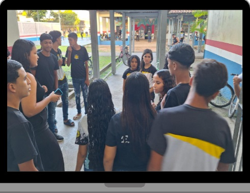

```{=html}
<style>
  body{text-align: justify}
</style>
```

:::: progress
::: {.progress-bar style="width: 100%;"}
:::
::::

# Cuidados Éticos e Pedagógicos

O trabalho com imagens na escola contemporânea exige rígida vigilância ética. Ao solicitar aos estudantes que produzam registros audiovisuais da realidade, o professor deve pautar discussões sobre os limites da exposição pública.

{fig-align="center" width="217"}

- **Direitos de Imagem**: Não é permitido gravar e expor pessoas sem sua expressa autorização, sobretudo em ambientes vulneráveis ou dentro do ambiente escolar, envolvendo menores de idade. A autorização documentada é um processo pedagógico sobre cidadania.

- **Respeito à Dignidade**: O olhar crítico não é um olhar persecutório. A investigação de contradições sociais não deve expor trabalhadores locais, alunos ou professores a constrangimentos ou humilhações públicas.


- **Crítica ao Sensacionalismo**: A linguagem das redes sociais frequentemente opera sob a lógica do espetáculo e da "lacração". A função do vídeo escolar é analítica. O professor deve combater exageros, mentiras descontextualizadas ou trilhas sonoras manipuladoras que reforcem preconceitos.

- **Checagem de Informações**: Qualquer dado estatístico ou denúncia presente nos vídeos deve passar por rigorosa checagem de fatos, junto às equipes antes da edição final.

:::: progress
::: {.progress-bar style="width: 100%;"}
:::
::::
