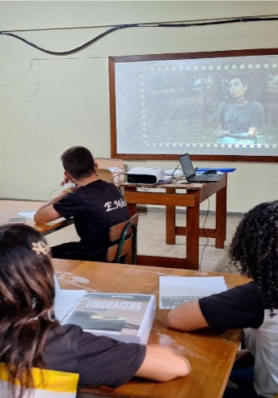

```{=html}
<style>
  body{text-align: justify}
</style>
```

:::: progress
::: {.progress-bar style="width: 100%;"}
:::
::::

# Considerações Finais

A aplicação da Metodologia da Transitividade através da produção audiovisual representa uma intervenção pedagógica vigorosa em prol de uma escola efetivamente conectada à vida social. Ao longo deste guia prático, evidenciou-se que o verdadeiro potencial do dispositivo móvel na sala de aula não repousa no consumo passivo, mas na sua capacidade de instrumentalizar o aluno na leitura crítica da realidade.


{fig-align="center" width="192"}

Neste trajeto que vai da codificação visual do cotidiano aos diálogos descodificadores, o estudante transita de uma postura observadora ingênua, para uma postura investigativa, consciente e reflexiva. Produzir um vídeo para redes sociais deixa de ser um mero ato de exposição pessoal, para converter-se em um profundo exercício ético, de autoria discursiva e intervenção cultural.


### Referência Base

A organização estrutural, pedagógica e teórica deste e-book foi consolidada a partir da sistematização de informações e análises oriundas da Dissertação de Mestrado: O recurso do áudiovisual no ensino de sociologia: o uso do celular na produção de minidocumentários para o exercício da metodologia da transitividade.

:::: progress
::: {.progress-bar style="width: 100%;"}
:::
::::
