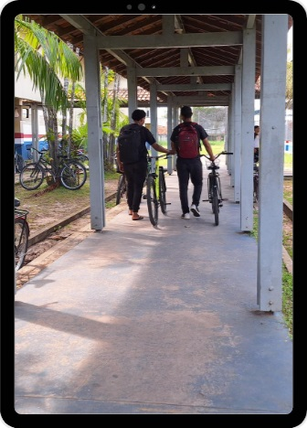

::: {.content-visible when-format="html"}

:::: progress
::: {.progress-bar style="width: 100%;"}
:::
::::

:::

# Introdução

No contexto do Novo Ensino Médio as atividades educativas que tem como proposta pedagógica mediar o conhecimento sistematizado com aquele sobre a vida prática, permitem que professores em diálogo com alunos tenham uma compreensão mais elaborada sobre o conhecimento difundido na escola. A proposta de produção do audiovisual adotada, possui como estratégia o aprofundamento dos saberes dos alunos pela investigação das vivências sociais, a fim de criar mecanismos de reflexão e ação sobre os problemas observados no cotidiano, ou seja, através do uso de celular pelos alunos busca-se uma forma de mediar o conhecimento com o contexto vivenciado pelo aluno.

{fig-align="center" width="187"}

Esta proposta da Metodologia da Transitividade, orientada pela produção de minidocumentários e de outras mídias audiovisuais, permite o seu compartilhamento como conteúdos educacionais nas redes sociais. Também visa fundamentar a produção de diversos conteúdos de visualização rápida para postagem nas redes sociais mais utilizadas pelos alunos no Instagram Reels, TikTok, Facebook Reels, Youtube shorts e Kwai.

\newpage

A metodologia utilizada nas oficinas nas atividades para o desenvolvimento do produto, foi a forma encontrada em desenvolver um produto de forma preliminar, porém considera-se que os resultados dessas experiências registradas no Guia Prático da Metodologia da Transitividade, podem ser aplicadas seguindo o formato de oficinas ou adequada a carga horária da disciplina, mediante contexto escolar de cada professor que pode adequar à quantidade de aulas que julgar necessário.

A intenção com essa experiência prática é apresentar uma metodologia de ensino para professores praticarem em sala de aula, visando tornar a aprendizagem de conteúdos sociológicos mais adequada a realidade dos educandos. Portanto, o objetivo não é apresentar um plano de aula, mas um Guia Metodológico onde o professor possa adaptá-lo às suas necessidades de ensino, adequado à cada contexto onde exerce a docência no suporte à produção de audiovisual com recurso didático.

::: {.content-visible when-format="html"}

:::: progress
::: {.progress-bar style="width: 100%;"}
:::
::::

:::

